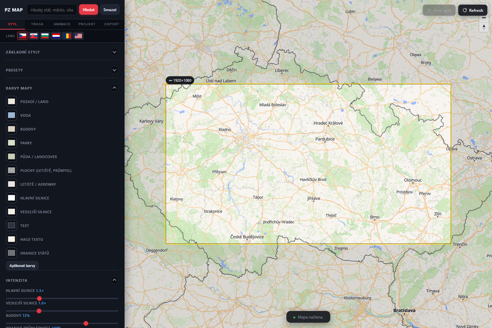

# PZ 2D Map



Browser-based 2D map editor for drawing routes, markers, labels, camera moves and exporting map frames/video-ready assets.

## Main files

```text
index.html      Main application
PZ2DMAP         Compatibility copy of the same app
map_api.php     Optional PHP API for saving/loading projects on PHP hosting
presets.json    Style presets
projects.json   Example/project data
map_data/       Runtime data directory placeholders
assets/         Original local icons
```

## Deployment

Upload the files to any static/PHP hosting. For saving projects on the server, PHP must be enabled and `map_api.php` must be writable to the configured data files.

## Map data and licensing warning

This application can use multiple third-party map/background/data sources. The MIT license in this repository covers only the application code, not the external maps, tiles, routing data, geocoding results, satellite imagery or boundary datasets.

Before public use, broadcast use, commercial use, export or redistribution, check the current terms, attribution rules, rate limits and branding requirements of every enabled map/data provider.

Typical external sources used or referenced by the app can include:

- OpenStreetMap tiles and OSM-derived map data
- OpenFreeMap vector styles
- CARTO basemap tiles
- Esri/ArcGIS World Imagery and terrain tiles
- OpenTopoMap
- CyclOSM
- Humanitarian OpenStreetMap Team tiles
- OpenStreetMap/Nominatim search and reverse geocoding
- OpenStreetMap routing demo servers
- EU GISCO country boundary GeoJSON
- Natural Earth boundary/country datasets
- CDN-hosted third-party JavaScript libraries such as MapLibre GL JS, JSZip and mp4-muxer

Do not assume that a source is free for every use case just because it is publicly reachable. Keep visible attribution in exported graphics where required and replace public demo endpoints with licensed/approved production endpoints when needed.

## Notes

The main `index.html` embeds the original plane/car icons as data URIs, so the page can still run even when asset upload is incomplete.

## Copyright and license

Copyright (c) 2026 **Petr Zavorka** and **TV Nova s.r.o.**

The source code was written by Petr Zavorka. Proprietary (economic) rights to the application are held jointly by Petr Zavorka and TV Nova s.r.o.

- **Source code:** published under the **MIT License** (see [LICENSE](LICENSE)) — you may use, modify and distribute it.
- **Branding:** the **"TN" / "TV Nova" logo and branding are NOT covered by the MIT grant.** They are trademarks of TV Nova s.r.o. The application may be used and distributed in its delivered form **with the visible "TN" logo**, and that branding **must be retained** — it may not be removed, hidden or replaced without the prior written consent of TV Nova s.r.o.
- **Third-party material:** map providers, tiles, geographic datasets, routing/geocoding services, satellite imagery, fonts and CDN libraries remain under their own licenses and terms (see [MAP_DATA_AND_LICENSES.md](MAP_DATA_AND_LICENSES.md)).
